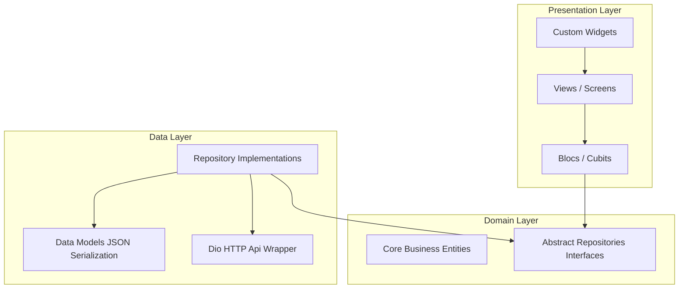
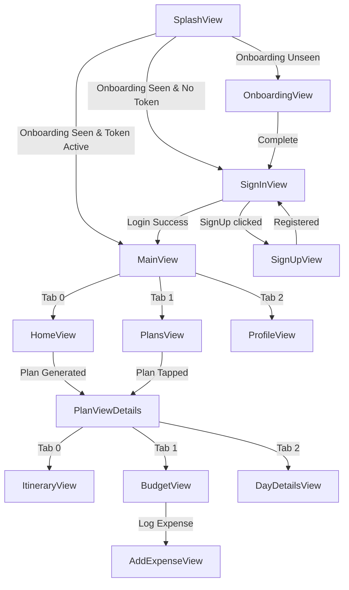
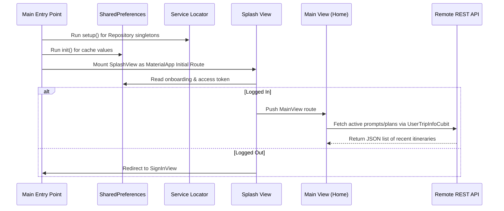

# TravelTrek Project Documentation

Welcome to the complete technical documentation for **TravelTrek**, a cross-platform mobile application designed to serve as an intelligent, AI-powered travel planner companion. This document provides an exhaustive architectural, structural, and behavioral guide to the codebase.

## Table of Contents
- [1. Project Overview](#1-project-overview)
- [2. Folder Structure](#2-folder-structure)
- [3. File Analysis](#3-file-analysis)
- [4. Architecture](#4-architecture)
- [5. Features](#5-features)
- [6. State Management](#6-state-management)
- [7. Routing & Navigation](#7-routing--navigation)
- [8. Data Layer](#8-data-layer)
- [9. Dependency Injection](#9-dependency-injection)
- [10. Configuration](#10-configuration)
- [11. Assets](#11-assets)
- [12. Third-Party Packages](#12-third-party-packages)
- [13. Execution Flow](#13-execution-flow)
- [14. Code Relationships](#14-code-relationships)
- [15. Potential Issues](#15-potential-issues)
- [16. Improvement Suggestions](#16-improvement-suggestions)
- [17. Mermaid Diagrams](#17-mermaid-diagrams)

---

## 1. Project Overview
### Purpose
TravelTrek is an AI-powered smart travel planning companion mobile app. It dynamically creates customized itineraries based on user destinations, budgets, durations, and group preferences. TravelTrek solves the complexity of travel preparation by generating highly-tailored travel itineraries, tracking travel budgets, offering local insights, and facilitating expense management.
### Main Functionality
- **AI Plan Generation**: Takes user destination, duration, budget range, and preferences to call an AI endpoint which generates a detailed travel itinerary.
- **Itinerary & Day Timeline**: Provides day-by-day break downs of activities, meal recommendations, activity durations, and local tips.
- **Smart Budgeting & Expense Tracking**: Displays a budget progress bar comparing budget against actual expenditures, breaks down costs by categories, and logs new expenses.
- **Local Currency & Insights**: Dynamically fetches the user's local currency and location, offering currency exchange rates and packing lists.
- **Secure Auth Flow**: Features registration, login, token refresh interceptors, and social authentication using Google Sign-In.
- **Profile Customization**: Supports uploading custom profile pictures via local camera/gallery and updating basic account profile information.
### Technology Stack
- **Core Framework**: Flutter (Dart)
- **State Management**: `flutter_bloc` (Cubit implementation)
- **Dependency Injection**: `get_it` (Service Locator)
- **Networking & HTTP**: `dio` (configured with `AuthInterceptor` for automatic access token refresh)
- **Authentication**: Firebase Authentication + Backend custom endpoints
- **Local Caching**: `shared_preferences` (token and local config storage)
- **Device Hardware**: `image_picker` for camera and gallery access
- **Location & Geolocation**: `geolocator` and `geocoding` for fetching user's locale and currency

---

## 2. Folder Structure
The project uses a structured architecture dividing files into `Features` and a shared `core` folder. Features follow Clean Architecture layers (Data, Domain, Presentation).

### Directory Tree
```
├── Features
│   ├── Budget
│   │   ├── data
│   │   │   ├── models
│   │   │   │   └── expense_model.dart
│   │   │   └── repos
│   │   │       └── expense_repo_imple.dart
│   │   ├── domain
│   │   │   ├── entites
│   │   │   │   └── expense_entity.dart
│   │   │   └── repos
│   │   │       └── expense_repo.dart
│   │   └── presentation
│   │       ├── manger
│   │       │   └── cubit
│   │       │       ├── expense_cubit.dart
│   │       │       └── expense_state.dart
│   │       └── views
│   │           ├── widgets
│   │           │   ├── add_amount_field.dart
│   │           │   ├── add_expense_view_body.dart
│   │           │   ├── budget_header.dart
│   │           │   ├── budget_progressbar.dart
│   │           │   ├── budget_view_body.dart
│   │           │   ├── build_budget_header.dart
│   │           │   ├── category_selector.dart
│   │           │   ├── data_textfiled.dart
│   │           │   ├── expense_category_card.dart
│   │           │   ├── expense_form_fields.dart
│   │           │   ├── expense_summary_section.dart
│   │           │   └── log_expense_button.dart
│   │           ├── add_expense_view.dart
│   │           └── budget_view.dart
│   ├── Plandetails
│   │   ├── data
│   │   │   └── repos
│   │   │       └── plan_repo_imple.dart
│   │   ├── domain
│   │   │   └── repos
│   │   │       └── plan_repo.dart
│   │   └── presentation
│   │       ├── manger
│   │       │   └── cubits
│   │       │       ├── plan_details_cubit.dart
│   │       │       └── plan_details_state.dart
│   │       └── views
│   │           ├── widgets
│   │           │   ├── action_btn.dart
│   │           │   ├── build_action_btn.dart
│   │           │   ├── build_detail_chip.dart
│   │           │   ├── build_empty.dart
│   │           │   ├── custom_tap_bar.dart
│   │           │   ├── day_card.dart
│   │           │   ├── itinerary_card_Info.dart
│   │           │   ├── itinerary_card_header.dart
│   │           │   ├── itinerary_view.dart
│   │           │   ├── local_currency_card.dart
│   │           │   ├── plan_view_details_body.dart
│   │           │   ├── section_header.dart
│   │           │   ├── sliver_list_builder_day_card.dart
│   │           │   ├── sliver_list_builder_trivel_trip.dart
│   │           │   ├── sliver_plan_header.dart
│   │           │   ├── top_tap.dart
│   │           │   └── travel_trips_card.dart
│   │           └── plan_view_details.dart
│   ├── auth
│   │   ├── data
│   │   │   ├── models
│   │   │   │   └── user_model.dart
│   │   │   └── repos
│   │   │       ├── auth_repo_imple.dart
│   │   │       └── auth_repo_imple_api.dart
│   │   ├── domain
│   │   │   ├── entity
│   │   │   │   └── user_entity.dart
│   │   │   └── repos
│   │   │       └── auth_repo.dart
│   │   └── presentation
│   │       ├── manger
│   │       │   ├── change_password_cubit
│   │       │   │   ├── change_password_cubit.dart
│   │       │   │   └── change_password_state.dart
│   │       │   ├── forgot_password_cubit
│   │       │   │   ├── forgot_password_cubit.dart
│   │       │   │   └── forgot_password_state.dart
│   │       │   ├── resend_verification_cubit
│   │       │   │   ├── resend_verification_cubit.dart
│   │       │   │   └── resend_verification_state.dart
│   │       │   ├── sign_in_cubit
│   │       │   │   ├── sign_in_cubit.dart
│   │       │   │   └── sign_in_state.dart
│   │       │   └── sign_up_cubit
│   │       │       ├── sign_up_cubit.dart
│   │       │       └── sign_up_state.dart
│   │       └── views
│   │           ├── widgets
│   │           │   ├── already_have_an_account.dart
│   │           │   ├── build_social_button.dart
│   │           │   ├── custom_or_dividor.dart
│   │           │   ├── custom_social_button.dart
│   │           │   ├── custom_text_form_field.dart
│   │           │   ├── dont_have_an_account.dart
│   │           │   ├── password_field.dart
│   │           │   ├── sign_in_view_body.dart
│   │           │   ├── sign_in_view_body_bloc_consumer.dart
│   │           │   ├── sign_up_logo.dart
│   │           │   ├── sign_up_view_body.dart
│   │           │   ├── sign_up_view_body_bloc_consumer.dart
│   │           │   └── terms_and_condtions.dart
│   │           ├── forgot_password_view.dart
│   │           ├── resend_verification_view.dart
│   │           ├── sign_in_view.dart
│   │           ├── sign_up_view.dart
│   │           └── trouble_signing_in_view.dart
│   ├── day_details
│   │   └── presentation
│   │       └── views
│   │           ├── widgets
│   │           │   ├── build_Local_lnsight.dart
│   │           │   ├── build_action_row.dart
│   │           │   ├── build_description.dart
│   │           │   ├── build_duration.dart
│   │           │   ├── build_header.dart
│   │           │   ├── day_card.dart
│   │           │   ├── day_details_list_view.dart
│   │           │   └── day_details_view_body.dart
│   │           └── day_details_view.dart
│   ├── home
│   │   ├── data
│   │   │   ├── models
│   │   │   │   ├── plan_model
│   │   │   │   │   ├── activity.dart
│   │   │   │   │   ├── day.dart
│   │   │   │   │   ├── error.dart
│   │   │   │   │   ├── meals.dart
│   │   │   │   │   ├── plan_model.dart
│   │   │   │   │   ├── value.dart
│   │   │   │   │   └── weather.dart
│   │   │   │   └── user_trip_info
│   │   │   │       ├── error.dart
│   │   │   │       ├── prompt.dart
│   │   │   │       ├── user_trip_info.dart
│   │   │   │       └── value.dart
│   │   │   └── repos
│   │   │       └── home_repo_imple.dart
│   │   ├── domain
│   │   │   └── repos
│   │   │       └── home_repo.dart
│   │   └── presentation
│   │       ├── manger
│   │       │   └── generate_plan
│   │       │       ├── generate_plan_cubit_cubit.dart
│   │       │       └── generate_plan_cubit_state.dart
│   │       └── views
│   │           ├── widgets
│   │           │   ├── active_item.dart
│   │           │   ├── bottom_navigation_bar.dart
│   │           │   ├── build_chip.dart
│   │           │   ├── home_view.dart
│   │           │   ├── home_view_body.dart
│   │           │   ├── in_active_item.dart
│   │           │   ├── main_view_body.dart
│   │           │   ├── naivgation_bar_item.dart
│   │           │   ├── recent_plan_item.dart
│   │           │   ├── recent_plan_list_view_builder.dart
│   │           │   ├── recent_plan_list_view_builder_bloc_builder.dart
│   │           │   └── trip_planner_input_field.dart
│   │           └── main_view.dart
│   ├── note
│   │   └── presentation
│   │       └── views
│   │           ├── widgets
│   │           │   ├── tips_view_body.dart
│   │           │   └── trip_tips_card.dart
│   │           └── tips_view.dart
│   ├── onboarding
│   │   └── presentation
│   │       └── views
│   │           ├── widgets
│   │           │   ├── card_info.dart
│   │           │   ├── on_barding_final_page_view.dart
│   │           │   ├── on_boarding_page_view.dart
│   │           │   ├── on_boarding_view_body.dart
│   │           │   └── page_view_item.dart
│   │           └── on_boarding_view.dart
│   ├── plans
│   │   ├── data
│   │   │   └── repos
│   │   │       └── plans_repo_imple.dart
│   │   ├── domain
│   │   │   └── repos
│   │   │       └── plans_repo.dart
│   │   └── presentation
│   │       ├── manger
│   │       │   └── cubit
│   │       │       ├── get_all_plans_cubit.dart
│   │       │       └── get_all_plans_state.dart
│   │       └── views
│   │           ├── widgets
│   │           │   ├── build_header_widget.dart
│   │           │   ├── build_plan_item.dart
│   │           │   ├── build_plant_item_sliver_list_builder.dart
│   │           │   ├── build_search_bar_widget.dart
│   │           │   ├── my_plans_view_body.dart
│   │           │   └── plan_item.dart
│   │           └── plans_view.dart
│   ├── profile
│   │   └── presentation
│   │       └── views
│   │           └── profile_view.dart
│   └── splash
│       └── presentation
│           └── views
│               ├── widgets
│               │   └── splash_view_body.dart
│               └── splash_view.dart
├── core
│   ├── cubits
│   │   └── cubit
│   │       ├── user_trip_info_cubit.dart
│   │       └── user_trip_info_state.dart
│   ├── entities
│   │   └── bottom_navigation_bar_entity.dart
│   ├── errors
│   │   ├── custom_exception.dart
│   │   └── failures.dart
│   ├── helper_function
│   │   ├── api.dart
│   │   ├── auth_interceptor.dart
│   │   ├── on_generate_route.dart
│   │   └── show_snack_bar.dart
│   ├── services
│   │   ├── backend_service.dart
│   │   ├── currency_location_service.dart
│   │   ├── firebase_auth_service.dart
│   │   ├── prefs.dart
│   │   ├── service_locator.dart
│   │   ├── simple_bloc_observer.dart
│   │   └── token_service.dart
│   ├── utils
│   │   ├── app_colors.dart
│   │   ├── app_images.dart
│   │   ├── app_route.dart
│   │   └── app_styles.dart
│   └── widgets
│       ├── app_logo.dart
│       ├── app_modal_hud.dart
│       ├── custom_app_bar.dart
│       └── custom_button.dart
├── constants.dart
├── firebase_options.dart
└── main.dart
```


### Folders Explanation
- **`lib/Features/`**: Contains self-contained feature modules. Each feature follows Clean Architecture layers:
  - `data/`: Models for parsing API responses and implementations of abstract repositories.
  - `domain/`: Business entities and abstract repository definitions representing core features.
  - `presentation/`: State managers (Blocs/Cubits) and views/widgets representing the UI.
- **`lib/core/`**: Shared core codebase utilized across multiple features:
  - `cubits/`: Shared Cubits (e.g. `UserTripInfoCubit` to share active trip info).
  - `entities/`: Common entities (e.g. navigation items).
  - `errors/`: Custom error and failure models.
  - `helper_function/`: Global static helpers (HTTP client, show snack bars, route generators).
  - `services/`: Global singletons (preferences, API endpoints, location services, bloc observers).
  - `utils/`: Theme assets (AppColors, AppStyles, AppImages).
  - `widgets/`: Resuable components (custom app bar, buttons, loaders).

---

# 3. File Analysis

This section provides an exhaustive catalog and analysis of all source files in the project codebase.

## Root / Constants

| File Path | Classes / Enums | Key Methods / Functions | Dependencies / Imports |
| :--- | :--- | :--- | :--- |
| `lib/constants.dart` | None | None | None |
| `lib/firebase_options.dart` | `DefaultFirebaseOptions` (Class) | None | None |
| `lib/main.dart` | `TravelTrek` (Class) | `build()` | `dart:developer`<br>`package:firebase_core/firebase_core.dart`<br>`package:flutter/material.dart`<br>`package:flutter_bloc/flutter_bloc.dart`<br>`travel_trek:/Features/splash/presentation/views/splash_view.dart`<br>`travel_trek:/constants.dart`<br>`travel_trek:/core/helper_function/on_generate_route.dart`<br>`travel_trek:/core/services/prefs.dart`<br>`travel_trek:/core/services/service_locator.dart`<br>`travel_trek:/core/services/simple_bloc_observer.dart`<br>`travel_trek:/core/utils/app_colors.dart`<br>`travel_trek:/firebase_options.dart` |

## Core: cubits

| File Path | Classes / Enums | Key Methods / Functions | Dependencies / Imports |
| :--- | :--- | :--- | :--- |
| `lib/core/cubits/cubit/user_trip_info_cubit.dart` | `UserTripInfoCubit` (Class) | `getUserTripInfo()` | `package:equatable/equatable.dart`<br>`package:flutter_bloc/flutter_bloc.dart`<br>`travel_trek:/Features/home/data/models/user_trip_info/user_trip_info.dart`<br>`travel_trek:/Features/home/domain/repos/home_repo.dart` |
| `lib/core/cubits/cubit/user_trip_info_state.dart` | None | None | None |

## Core: entities

| File Path | Classes / Enums | Key Methods / Functions | Dependencies / Imports |
| :--- | :--- | :--- | :--- |
| `lib/core/entities/bottom_navigation_bar_entity.dart` | `BottomNavigationBarEntity` (Class) | None | `travel_trek:/core/utils/app_images.dart` |

## Core: errors

| File Path | Classes / Enums | Key Methods / Functions | Dependencies / Imports |
| :--- | :--- | :--- | :--- |
| `lib/core/errors/custom_exception.dart` | `CustomException` (Class) | None | None |
| `lib/core/errors/failures.dart` | `Failures` (Class)<br>`ServerFailure` (Class) | None | None |

## Core: helper_function

| File Path | Classes / Enums | Key Methods / Functions | Dependencies / Imports |
| :--- | :--- | :--- | :--- |
| `lib/core/helper_function/api.dart` | `Api` (Class) | `get()` | `package:dio/dio.dart`<br>`travel_trek:/core/errors/custom_exception.dart` |
| `lib/core/helper_function/auth_interceptor.dart` | `AuthInterceptor` (Class) | `onRequest()`, `onError()` | `dart:developer`<br>`package:dio/dio.dart`<br>`travel_trek:/constants.dart`<br>`travel_trek:/core/services/prefs.dart`<br>`travel_trek:/core/services/token_service.dart` |
| `lib/core/helper_function/on_generate_route.dart` | None | None | `package:flutter/material.dart`<br>`travel_trek:/Features/auth/presentation/views/forgot_password_view.dart`<br>`travel_trek:/Features/auth/presentation/views/resend_verification_view.dart`<br>`travel_trek:/Features/auth/presentation/views/sign_in_view.dart`<br>`travel_trek:/Features/auth/presentation/views/sign_up_view.dart`<br>`travel_trek:/Features/auth/presentation/views/trouble_signing_in_view.dart`<br>`travel_trek:/Features/home/presentation/views/main_view.dart`<br>`travel_trek:/Features/Plandetails/presentation/views/plan_view_details.dart`<br>`travel_trek:/Features/home/data/models/plan_model/plan_model.dart`<br>`travel_trek:/Features/onboarding/presentation/views/on_boarding_view.dart`<br>`travel_trek:/Features/profile/presentation/views/profile_view.dart`<br>`travel_trek:/Features/splash/presentation/views/splash_view.dart` |
| `lib/core/helper_function/show_snack_bar.dart` | None | None | `package:flutter/material.dart` |

## Core: services

| File Path | Classes / Enums | Key Methods / Functions | Dependencies / Imports |
| :--- | :--- | :--- | :--- |
| `lib/core/services/backend_service.dart` | `BackendService` (Class) | None | None |
| `lib/core/services/currency_location_service.dart` | `CurrencyLocationService` (Class) | `getUserCurrency()`, `_getCurrencyFromLocale()`, `_getCurrencyFromCountryCode()` | `package:geocoding/geocoding.dart`<br>`package:geolocator/geolocator.dart` |
| `lib/core/services/firebase_auth_service.dart` | `FirebaseAuthService` (Class) | `signInWithGoogle()` | `dart:developer`<br>`package:firebase_auth/firebase_auth.dart`<br>`package:google_sign_in/google_sign_in.dart`<br>`travel_trek:/core/errors/custom_exception.dart` |
| `lib/core/services/prefs.dart` | `Prefs` (Class) | `init()`, `setBool()`, `setString()`, `getBool()`, `getString()`, `setUserEntity()`, `removeUserEntity()` | `dart:developer`<br>`package:shared_preferences/shared_preferences.dart`<br>`travel_trek:/Features/auth/domain/entity/user_entity.dart`<br>`dart:convert`<br>`travel_trek:/constants.dart` |
| `lib/core/services/service_locator.dart` | None | None | `package:dio/dio.dart`<br>`package:get_it/get_it.dart`<br>`travel_trek:/Features/Budget/data/repos/expense_repo_imple.dart`<br>`travel_trek:/Features/Budget/domain/repos/expense_repo.dart`<br>`travel_trek:/Features/auth/data/repos/auth_repo_imple_api.dart`<br>`travel_trek:/Features/auth/domain/repos/auth_repo.dart`<br>`travel_trek:/Features/Plandetails/data/repos/plan_repo_imple.dart`<br>`travel_trek:/Features/Plandetails/domain/repos/plan_repo.dart`<br>`travel_trek:/Features/home/data/repos/home_repo_imple.dart`<br>`travel_trek:/Features/home/domain/repos/home_repo.dart`<br>`travel_trek:/Features/plans/data/repos/plans_repo_imple.dart`<br>`travel_trek:/Features/plans/domain/repos/plans_repo.dart`<br>`travel_trek:/core/helper_function/api.dart`<br>`travel_trek:/core/helper_function/auth_interceptor.dart`<br>`travel_trek:/core/services/firebase_auth_service.dart` |
| `lib/core/services/simple_bloc_observer.dart` | `SimpleBlocObserver` (Class) | `onChange()` | `dart:developer`<br>`package:flutter_bloc/flutter_bloc.dart` |
| `lib/core/services/token_service.dart` | `TokenService` (Class) | `revokeToken()`, `revokeAllTokens()` | `dart:developer`<br>`package:dio/dio.dart`<br>`travel_trek:/constants.dart`<br>`travel_trek:/core/services/backend_service.dart`<br>`travel_trek:/core/services/prefs.dart` |

## Core: utils

| File Path | Classes / Enums | Key Methods / Functions | Dependencies / Imports |
| :--- | :--- | :--- | :--- |
| `lib/core/utils/app_colors.dart` | `AppColors` (Class) | None | `package:flutter/material.dart` |
| `lib/core/utils/app_images.dart` | `Assets` (Class) | None | None |
| `lib/core/utils/app_route.dart` | `AppRoute` (Class) | None | `package:go_router/go_router.dart`<br>`travel_trek:/Features/splash/presentation/views/splash_view.dart` |
| `lib/core/utils/app_styles.dart` | `AppStyles` (Class) | None | `package:flutter/widgets.dart`<br>`travel_trek:/core/utils/app_colors.dart` |

## Core: widgets

| File Path | Classes / Enums | Key Methods / Functions | Dependencies / Imports |
| :--- | :--- | :--- | :--- |
| `lib/core/widgets/app_logo.dart` | `AppLogo` (Class)<br>`_Initials` (Class) | `build()`, `build()` | `dart:io`<br>`package:flutter/material.dart`<br>`travel_trek:/constants.dart`<br>`travel_trek:/core/services/prefs.dart` |
| `lib/core/widgets/app_modal_hud.dart` | `AppModalHud` (Class) | `build()` | `package:flutter/material.dart` |
| `lib/core/widgets/custom_app_bar.dart` | None | None | `package:flutter/material.dart`<br>`travel_trek:/core/widgets/app_logo.dart` |
| `lib/core/widgets/custom_button.dart` | `CustomButton` (Class) | `build()` | `package:flutter/material.dart` |

## Feature: auth

| File Path | Classes / Enums | Key Methods / Functions | Dependencies / Imports |
| :--- | :--- | :--- | :--- |
| `lib/Features/auth/data/models/user_model.dart` | `UserModel` (Class) | None | `package:firebase_auth/firebase_auth.dart`<br>`travel_trek:/Features/auth/domain/entity/user_entity.dart` |
| `lib/Features/auth/data/repos/auth_repo_imple.dart` | `AuthRepoImple` (Class) | None | `dart:developer`<br>`package:dartz/dartz.dart`<br>`travel_trek:/Features/auth/data/models/user_model.dart`<br>`travel_trek:/Features/auth/domain/entity/user_entity.dart`<br>`travel_trek:/Features/auth/domain/repos/auth_repo.dart`<br>`travel_trek:/core/errors/custom_exception.dart`<br>`travel_trek:/core/errors/failures.dart`<br>`travel_trek:/core/services/firebase_auth_service.dart` |
| `lib/Features/auth/data/repos/auth_repo_imple_api.dart` | `AuthRepoImpleApi` (Class) | None | `dart:developer`<br>`package:dartz/dartz.dart`<br>`package:dio/dio.dart`<br>`travel_trek:/Features/auth/data/models/user_model.dart`<br>`travel_trek:/Features/auth/domain/entity/user_entity.dart`<br>`travel_trek:/Features/auth/domain/repos/auth_repo.dart`<br>`travel_trek:/constants.dart`<br>`travel_trek:/core/errors/custom_exception.dart`<br>`travel_trek:/core/errors/failures.dart`<br>`travel_trek:/core/helper_function/api.dart`<br>`travel_trek:/core/services/backend_service.dart`<br>`travel_trek:/core/services/firebase_auth_service.dart`<br>`travel_trek:/core/services/prefs.dart` |
| `lib/Features/auth/domain/entity/user_entity.dart` | `UserEntity` (Class) | None | None |
| `lib/Features/auth/domain/repos/auth_repo.dart` | `AuthRepo` (Class) | None | `package:dartz/dartz.dart`<br>`travel_trek:/Features/auth/domain/entity/user_entity.dart`<br>`travel_trek:/core/errors/failures.dart` |
| `lib/Features/auth/presentation/manger/change_password_cubit/change_password_cubit.dart` | `ChangePasswordCubit` (Class) | None | `package:flutter_bloc/flutter_bloc.dart`<br>`travel_trek:/Features/auth/domain/repos/auth_repo.dart` |
| `lib/Features/auth/presentation/manger/change_password_cubit/change_password_state.dart` | `ChangePasswordState` (Class) | None | None |
| `lib/Features/auth/presentation/manger/forgot_password_cubit/forgot_password_cubit.dart` | `ForgotPasswordCubit` (Class) | `forgotPassword()` | `package:flutter_bloc/flutter_bloc.dart`<br>`travel_trek:/Features/auth/domain/repos/auth_repo.dart` |
| `lib/Features/auth/presentation/manger/forgot_password_cubit/forgot_password_state.dart` | None | None | None |
| `lib/Features/auth/presentation/manger/resend_verification_cubit/resend_verification_cubit.dart` | `ResendVerificationCubit` (Class) | `resendVerification()` | `package:flutter_bloc/flutter_bloc.dart`<br>`travel_trek:/Features/auth/domain/repos/auth_repo.dart` |
| `lib/Features/auth/presentation/manger/resend_verification_cubit/resend_verification_state.dart` | None | None | None |
| `lib/Features/auth/presentation/manger/sign_in_cubit/sign_in_cubit.dart` | `SignInCubit` (Class) | `signInWithGoogle()` | `package:flutter_bloc/flutter_bloc.dart`<br>`travel_trek:/Features/auth/domain/entity/user_entity.dart`<br>`travel_trek:/Features/auth/domain/repos/auth_repo.dart` |
| `lib/Features/auth/presentation/manger/sign_in_cubit/sign_in_state.dart` | `SignInState` (Class) | None | None |
| `lib/Features/auth/presentation/manger/sign_up_cubit/sign_up_cubit.dart` | `SignUpCubit` (Class) | None | `package:flutter_bloc/flutter_bloc.dart`<br>`travel_trek:/Features/auth/domain/entity/user_entity.dart`<br>`travel_trek:/Features/auth/domain/repos/auth_repo.dart` |
| `lib/Features/auth/presentation/manger/sign_up_cubit/sign_up_state.dart` | `SignUpState` (Class) | None | None |
| `lib/Features/auth/presentation/views/forgot_password_view.dart` | `ForgotPasswordView` (Class)<br>`_ForgotPasswordBody` (Class)<br>`_ForgotPasswordBodyState` (Class) | `build()`, `dispose()`, `build()` | `package:flutter/material.dart`<br>`package:flutter_bloc/flutter_bloc.dart`<br>`travel_trek:/Features/auth/domain/repos/auth_repo.dart`<br>`travel_trek:/Features/auth/presentation/manger/forgot_password_cubit/forgot_password_cubit.dart`<br>`travel_trek:/core/services/service_locator.dart` |
| `lib/Features/auth/presentation/views/resend_verification_view.dart` | `ResendVerificationView` (Class)<br>`_ResendVerificationBody` (Class)<br>`_ResendVerificationBodyState` (Class) | `build()`, `dispose()`, `build()` | `package:flutter/material.dart`<br>`package:flutter_bloc/flutter_bloc.dart`<br>`travel_trek:/Features/auth/domain/repos/auth_repo.dart`<br>`travel_trek:/Features/auth/presentation/manger/resend_verification_cubit/resend_verification_cubit.dart`<br>`travel_trek:/core/services/service_locator.dart` |
| `lib/Features/auth/presentation/views/sign_in_view.dart` | `SignInView` (Class) | `build()` | `package:flutter/material.dart`<br>`package:flutter_bloc/flutter_bloc.dart`<br>`travel_trek:/Features/auth/domain/repos/auth_repo.dart`<br>`travel_trek:/Features/auth/presentation/manger/sign_in_cubit/sign_in_cubit.dart`<br>`travel_trek:/Features/auth/presentation/views/widgets/sign_in_view_body_bloc_consumer.dart`<br>`travel_trek:/core/services/service_locator.dart` |
| `lib/Features/auth/presentation/views/sign_up_view.dart` | `SignUpView` (Class) | `build()` | `package:flutter/material.dart`<br>`package:flutter_bloc/flutter_bloc.dart`<br>`travel_trek:/Features/auth/domain/repos/auth_repo.dart`<br>`travel_trek:/Features/auth/presentation/manger/sign_up_cubit/sign_up_cubit.dart`<br>`travel_trek:/Features/auth/presentation/views/widgets/sign_up_view_body_bloc_consumer.dart`<br>`travel_trek:/core/services/service_locator.dart` |
| `lib/Features/auth/presentation/views/trouble_signing_in_view.dart` | `TroubleSigningInView` (Class)<br>`_TroubleOption` (Class) | `build()`, `build()` | `package:flutter/material.dart`<br>`travel_trek:/Features/auth/presentation/views/forgot_password_view.dart`<br>`travel_trek:/Features/auth/presentation/views/resend_verification_view.dart` |
| `lib/Features/auth/presentation/views/widgets/already_have_an_account.dart` | `AlreadyHaveAnAccound` (Class) | `build()` | `package:flutter/material.dart` |
| `lib/Features/auth/presentation/views/widgets/build_social_button.dart` | `BuildSocialButton` (Class) | `build()` | `package:flutter/material.dart`<br>`package:flutter_bloc/flutter_bloc.dart`<br>`travel_trek:/Features/auth/presentation/manger/sign_in_cubit/sign_in_cubit.dart`<br>`travel_trek:/Features/auth/presentation/views/widgets/custom_social_button.dart` |
| `lib/Features/auth/presentation/views/widgets/custom_or_dividor.dart` | `CustomOrDivider` (Class) | `build()` | `package:flutter/material.dart` |
| `lib/Features/auth/presentation/views/widgets/custom_social_button.dart` | `CustomSocialButton` (Class) | `build()` | `package:flutter/material.dart` |
| `lib/Features/auth/presentation/views/widgets/custom_text_form_field.dart` | `CustomTextFormField` (Class) | `build()`, `buildBorder()` | `package:flutter/material.dart` |
| `lib/Features/auth/presentation/views/widgets/dont_have_an_account.dart` | `DontHaveAnAccount` (Class) | `build()` | `package:flutter/material.dart`<br>`travel_trek:/Features/auth/presentation/views/sign_up_view.dart` |
| `lib/Features/auth/presentation/views/widgets/password_field.dart` | `PasswordField` (Class)<br>`_PasswordFieldState` (Class) | `build()` | `package:flutter/material.dart`<br>`travel_trek:/Features/auth/presentation/views/widgets/custom_text_form_field.dart` |
| `lib/Features/auth/presentation/views/widgets/sign_in_view_body.dart` | `SignInViewBody` (Class)<br>`_SignInViewBodyState` (Class) | `build()` | `package:flutter/material.dart`<br>`package:flutter_bloc/flutter_bloc.dart`<br>`travel_trek:/Features/auth/presentation/manger/sign_in_cubit/sign_in_cubit.dart`<br>`travel_trek:/Features/auth/presentation/views/trouble_signing_in_view.dart`<br>`travel_trek:/Features/auth/presentation/views/widgets/build_social_button.dart`<br>`travel_trek:/Features/auth/presentation/views/widgets/custom_or_dividor.dart`<br>`travel_trek:/Features/auth/presentation/views/widgets/custom_text_form_field.dart`<br>`travel_trek:/Features/auth/presentation/views/widgets/dont_have_an_account.dart`<br>`travel_trek:/Features/auth/presentation/views/widgets/password_field.dart`<br>`travel_trek:/Features/auth/presentation/views/widgets/terms_and_condtions.dart`<br>`travel_trek:/core/widgets/custom_button.dart` |
| `lib/Features/auth/presentation/views/widgets/sign_in_view_body_bloc_consumer.dart` | `SignInViewBodyBlocConsumer` (Class) | `build()` | `package:flutter/material.dart`<br>`package:flutter_bloc/flutter_bloc.dart`<br>`travel_trek:/Features/auth/presentation/manger/sign_in_cubit/sign_in_cubit.dart`<br>`travel_trek:/Features/auth/presentation/views/widgets/sign_in_view_body.dart`<br>`travel_trek:/Features/home/presentation/views/main_view.dart`<br>`travel_trek:/constants.dart`<br>`travel_trek:/core/helper_function/show_snack_bar.dart`<br>`travel_trek:/core/services/prefs.dart`<br>`travel_trek:/core/widgets/app_modal_hud.dart` |
| `lib/Features/auth/presentation/views/widgets/sign_up_logo.dart` | `SignUpLogo` (Class) | `build()` | `package:flutter/material.dart` |
| `lib/Features/auth/presentation/views/widgets/sign_up_view_body.dart` | `SignUpViewBody` (Class)<br>`_SignUpViewBodyState` (Class) | `build()` | `package:flutter/material.dart`<br>`package:flutter_bloc/flutter_bloc.dart`<br>`travel_trek:/Features/auth/presentation/manger/sign_up_cubit/sign_up_cubit.dart`<br>`travel_trek:/Features/auth/presentation/views/widgets/already_have_an_account.dart`<br>`travel_trek:/Features/auth/presentation/views/widgets/custom_or_dividor.dart`<br>`travel_trek:/Features/auth/presentation/views/widgets/custom_text_form_field.dart`<br>`travel_trek:/Features/auth/presentation/views/widgets/password_field.dart`<br>`travel_trek:/Features/auth/presentation/views/widgets/sign_up_logo.dart`<br>`travel_trek:/core/widgets/custom_button.dart` |
| `lib/Features/auth/presentation/views/widgets/sign_up_view_body_bloc_consumer.dart` | `SignupViewBodyBlocConsumer` (Class) | `build()` | `package:flutter/material.dart`<br>`package:flutter_bloc/flutter_bloc.dart`<br>`travel_trek:/Features/auth/presentation/manger/sign_up_cubit/sign_up_cubit.dart`<br>`travel_trek:/Features/auth/presentation/views/widgets/sign_up_view_body.dart`<br>`travel_trek:/core/helper_function/show_snack_bar.dart`<br>`travel_trek:/core/widgets/app_modal_hud.dart` |
| `lib/Features/auth/presentation/views/widgets/terms_and_condtions.dart` | `TermsAndCondtions` (Class)<br>`_TermsAndCondtionsState` (Class) | `build()` | `package:flutter/material.dart`<br>`travel_trek:/constants.dart`<br>`travel_trek:/core/services/prefs.dart` |

## Feature: Budget

| File Path | Classes / Enums | Key Methods / Functions | Dependencies / Imports |
| :--- | :--- | :--- | :--- |
| `lib/Features/Budget/data/models/expense_model.dart` | `ExpenseModel` (Class) | `toEntity()` | `travel_trek:/Features/Budget/domain/entites/expense_entity.dart` |
| `lib/Features/Budget/data/repos/expense_repo_imple.dart` | `ExpenseRepoImple` (Class) | None | `package:dartz/dartz.dart`<br>`travel_trek:/Features/Budget/data/models/expense_model.dart`<br>`travel_trek:/Features/Budget/domain/entites/expense_entity.dart`<br>`travel_trek:/Features/Budget/domain/repos/expense_repo.dart`<br>`travel_trek:/core/errors/failures.dart`<br>`travel_trek:/core/helper_function/api.dart`<br>`travel_trek:/core/services/backend_service.dart` |
| `lib/Features/Budget/domain/entites/expense_entity.dart` | `ExpenseEntity` (Class) | None | None |
| `lib/Features/Budget/domain/repos/expense_repo.dart` | `ExpenseRepo` (Class) | None | `package:dartz/dartz.dart`<br>`travel_trek:/Features/Budget/domain/entites/expense_entity.dart`<br>`travel_trek:/core/errors/failures.dart` |
| `lib/Features/Budget/presentation/manger/cubit/expense_cubit.dart` | `ExpenseCubit` (Class) | None | `package:equatable/equatable.dart`<br>`package:flutter_bloc/flutter_bloc.dart`<br>`travel_trek:/Features/Budget/domain/entites/expense_entity.dart`<br>`travel_trek:/Features/Budget/domain/repos/expense_repo.dart` |
| `lib/Features/Budget/presentation/manger/cubit/expense_state.dart` | None | None | None |
| `lib/Features/Budget/presentation/views/add_expense_view.dart` | `AddExpenseView` (Class) | `build()` | `package:flutter/material.dart`<br>`package:flutter_bloc/flutter_bloc.dart`<br>`travel_trek:/Features/Budget/presentation/manger/cubit/expense_cubit.dart`<br>`travel_trek:/Features/Budget/presentation/views/widgets/add_expense_view_body.dart`<br>`travel_trek:/Features/home/data/models/plan_model/plan_model.dart` |
| `lib/Features/Budget/presentation/views/budget_view.dart` | `BudgetView` (Class) | `build()` | `package:flutter/material.dart`<br>`package:flutter_bloc/flutter_bloc.dart`<br>`travel_trek:/Features/Budget/domain/repos/expense_repo.dart`<br>`travel_trek:/Features/Budget/presentation/manger/cubit/expense_cubit.dart`<br>`travel_trek:/Features/Budget/presentation/views/widgets/budget_view_body.dart`<br>`travel_trek:/Features/home/data/models/plan_model/plan_model.dart`<br>`travel_trek:/constants.dart`<br>`travel_trek:/core/services/prefs.dart`<br>`travel_trek:/core/services/service_locator.dart` |
| `lib/Features/Budget/presentation/views/widgets/add_amount_field.dart` | `AddAmountField` (Class)<br>`_AddAmountFieldState` (Class) | `initState()`, `build()`, `dispose()` | `package:flutter/material.dart`<br>`package:flutter/services.dart` |
| `lib/Features/Budget/presentation/views/widgets/add_expense_view_body.dart` | `AddExpenseViewBody` (Class)<br>`_AddExpenseViewBodyState` (Class) | `build()` | `dart:developer`<br>`package:flutter/material.dart`<br>`package:flutter_bloc/flutter_bloc.dart`<br>`travel_trek:/Features/Budget/domain/entites/expense_entity.dart`<br>`travel_trek:/Features/Budget/presentation/manger/cubit/expense_cubit.dart`<br>`travel_trek:/Features/Budget/presentation/views/widgets/add_amount_field.dart`<br>`travel_trek:/Features/Budget/presentation/views/widgets/category_selector.dart`<br>`travel_trek:/Features/Budget/presentation/views/widgets/expense_form_fields.dart`<br>`travel_trek:/Features/home/data/models/plan_model/plan_model.dart`<br>`travel_trek:/constants.dart`<br>`travel_trek:/core/services/prefs.dart`<br>`travel_trek:/core/widgets/custom_button.dart` |
| `lib/Features/Budget/presentation/views/widgets/budget_header.dart` | `BudgetHeader` (Class) | `build()` | `package:flutter/material.dart`<br>`travel_trek:/Features/Budget/presentation/views/add_expense_view.dart`<br>`travel_trek:/Features/Budget/presentation/views/widgets/budget_progressbar.dart`<br>`travel_trek:/Features/Budget/presentation/views/widgets/log_expense_button.dart`<br>`package:flutter_bloc/flutter_bloc.dart`<br>`travel_trek:/Features/Budget/presentation/manger/cubit/expense_cubit.dart`<br>`travel_trek:/Features/home/data/models/plan_model/plan_model.dart` |
| `lib/Features/Budget/presentation/views/widgets/budget_progressbar.dart` | `BudgetProgressBar` (Class) | `build()` | `package:flutter/material.dart` |
| `lib/Features/Budget/presentation/views/widgets/budget_view_body.dart` | `BudgetViewBody` (Class) | `build()` | `package:flutter/material.dart`<br>`travel_trek:/Features/Budget/presentation/views/widgets/build_budget_header.dart`<br>`travel_trek:/Features/Budget/presentation/views/widgets/expense_summary_section.dart`<br>`package:flutter_bloc/flutter_bloc.dart`<br>`travel_trek:/Features/Budget/presentation/manger/cubit/expense_cubit.dart`<br>`travel_trek:/Features/home/data/models/plan_model/plan_model.dart` |
| `lib/Features/Budget/presentation/views/widgets/build_budget_header.dart` | `BuildBudgetHeader` (Class)<br>`_BuildBudgetHeaderState` (Class) | `initState()`, `build()` | `package:flutter/material.dart`<br>`package:flutter_bloc/flutter_bloc.dart`<br>`package:intl/intl.dart`<br>`travel_trek:/Features/Budget/presentation/manger/cubit/expense_cubit.dart`<br>`travel_trek:/Features/Budget/presentation/views/widgets/budget_header.dart`<br>`travel_trek:/Features/home/data/models/plan_model/plan_model.dart` |
| `lib/Features/Budget/presentation/views/widgets/category_selector.dart` | `CategorySelector` (Class)<br>`_CategorySelectorState` (Class) | `dispose()`, `build()` | `package:flutter/material.dart` |
| `lib/Features/Budget/presentation/views/widgets/data_textfiled.dart` | `DateTextfiled` (Class)<br>`_DateTextfiledState` (Class) | `build()`, `_selectDate()`, `dispose()` | `package:flutter/material.dart`<br>`package:intl/intl.dart` |
| `lib/Features/Budget/presentation/views/widgets/expense_category_card.dart` | `ExpenseCategoryCard` (Class) | `build()` | `package:flutter/material.dart` |
| `lib/Features/Budget/presentation/views/widgets/expense_form_fields.dart` | `DescriptionField` (Class) | `build()` | `package:flutter/material.dart` |
| `lib/Features/Budget/presentation/views/widgets/expense_summary_section.dart` | `ExpenseSummarySection` (Class) | `build()` | `package:flutter/material.dart`<br>`travel_trek:/Features/Budget/domain/entites/expense_entity.dart`<br>`travel_trek:/Features/Budget/presentation/views/widgets/expense_category_card.dart` |
| `lib/Features/Budget/presentation/views/widgets/log_expense_button.dart` | `LogExpenseButton` (Class)<br>`_LogExpenseButtonState` (Class) | `build()` | `package:flutter/material.dart` |

## Feature: day_details

| File Path | Classes / Enums | Key Methods / Functions | Dependencies / Imports |
| :--- | :--- | :--- | :--- |
| `lib/Features/day_details/presentation/views/day_details_view.dart` | `DayDetailsView` (Class) | `build()` | `package:flutter/material.dart`<br>`travel_trek:/Features/day_details/presentation/views/widgets/day_details_view_body.dart`<br>`travel_trek:/Features/home/data/models/plan_model/plan_model.dart` |
| `lib/Features/day_details/presentation/views/widgets/build_action_row.dart` | None | None | `package:flutter/material.dart` |
| `lib/Features/day_details/presentation/views/widgets/build_description.dart` | None | None | `package:flutter/material.dart` |
| `lib/Features/day_details/presentation/views/widgets/build_duration.dart` | None | None | `package:flutter/material.dart` |
| `lib/Features/day_details/presentation/views/widgets/build_header.dart` | None | None | `package:flutter/material.dart` |
| `lib/Features/day_details/presentation/views/widgets/build_Local_lnsight.dart` | None | None | `package:flutter/material.dart` |
| `lib/Features/day_details/presentation/views/widgets/day_card.dart` | `DayDetailsCard` (Class) | `build()` | `package:flutter/material.dart`<br>`travel_trek:/Features/day_details/presentation/views/widgets/build_Local_lnsight.dart`<br>`travel_trek:/Features/day_details/presentation/views/widgets/build_action_row.dart`<br>`travel_trek:/Features/day_details/presentation/views/widgets/build_description.dart`<br>`travel_trek:/Features/day_details/presentation/views/widgets/build_duration.dart`<br>`travel_trek:/Features/day_details/presentation/views/widgets/build_header.dart` |
| `lib/Features/day_details/presentation/views/widgets/day_details_list_view.dart` | `DayDetailsSliverList` (Class) | `build()` | `package:flutter/material.dart`<br>`travel_trek:/Features/day_details/presentation/views/widgets/day_card.dart` |
| `lib/Features/day_details/presentation/views/widgets/day_details_view_body.dart` | `DayDetailsViewBody` (Class)<br>`_DayDetailsViewBodyState` (Class)<br>`_DaySelector` (Class)<br>`_DayActivitiesList` (Class)<br>`_ActivityTimelineCard` (Class)<br>`_MealsCard` (Class) | `build()`, `build()`, `build()`, `build()`, `build()`, `_mealRow()` | `package:flutter/material.dart`<br>`travel_trek:/Features/home/data/models/plan_model/day.dart`<br>`travel_trek:/Features/home/data/models/plan_model/plan_model.dart` |

## Feature: home

| File Path | Classes / Enums | Key Methods / Functions | Dependencies / Imports |
| :--- | :--- | :--- | :--- |
| `lib/Features/home/data/models/plan_model/activity.dart` | `Activity` (Class) | None | `package:equatable/equatable.dart` |
| `lib/Features/home/data/models/plan_model/day.dart` | `Day` (Class) | None | `package:equatable/equatable.dart`<br>`activity.dart`<br>`meals.dart` |
| `lib/Features/home/data/models/plan_model/error.dart` | `Error` (Class) | None | `package:equatable/equatable.dart` |
| `lib/Features/home/data/models/plan_model/meals.dart` | `Meals` (Class) | None | `package:equatable/equatable.dart` |
| `lib/Features/home/data/models/plan_model/plan_model.dart` | `PlanModel` (Class) | `fromHistoryJson()` | `package:equatable/equatable.dart`<br>`error.dart`<br>`value.dart` |
| `lib/Features/home/data/models/plan_model/value.dart` | `Value` (Class) | None | `package:equatable/equatable.dart`<br>`day.dart`<br>`weather.dart` |
| `lib/Features/home/data/models/plan_model/weather.dart` | `Weather` (Class) | None | `package:equatable/equatable.dart` |
| `lib/Features/home/data/models/user_trip_info/error.dart` | `Error` (Class) | None | `package:equatable/equatable.dart` |
| `lib/Features/home/data/models/user_trip_info/prompt.dart` | `Prompt` (Class) | None | `package:equatable/equatable.dart` |
| `lib/Features/home/data/models/user_trip_info/user_trip_info.dart` | `UserTripInfo` (Class) | None | `package:equatable/equatable.dart`<br>`error.dart`<br>`value.dart` |
| `lib/Features/home/data/models/user_trip_info/value.dart` | `Value` (Class) | None | `package:equatable/equatable.dart`<br>`prompt.dart` |
| `lib/Features/home/data/repos/home_repo_imple.dart` | `HomeRepoImple` (Class) | None | `package:dartz/dartz.dart`<br>`travel_trek:/Features/home/data/models/plan_model/plan_model.dart`<br>`travel_trek:/Features/home/data/models/user_trip_info/user_trip_info.dart`<br>`travel_trek:/Features/home/domain/repos/home_repo.dart`<br>`travel_trek:/core/errors/failures.dart`<br>`travel_trek:/core/helper_function/api.dart`<br>`travel_trek:/core/services/backend_service.dart` |
| `lib/Features/home/domain/repos/home_repo.dart` | `HomeRepo` (Class) | None | `package:dartz/dartz.dart`<br>`travel_trek:/Features/home/data/models/plan_model/plan_model.dart`<br>`travel_trek:/Features/home/data/models/user_trip_info/user_trip_info.dart`<br>`travel_trek:/core/errors/failures.dart` |
| `lib/Features/home/presentation/manger/generate_plan/generate_plan_cubit_cubit.dart` | `GeneratePlanCubitCubit` (Class) | `generatePlan()` | `package:equatable/equatable.dart`<br>`package:flutter_bloc/flutter_bloc.dart`<br>`travel_trek:/Features/home/data/models/plan_model/plan_model.dart`<br>`travel_trek:/Features/home/domain/repos/home_repo.dart` |
| `lib/Features/home/presentation/manger/generate_plan/generate_plan_cubit_state.dart` | None | None | None |
| `lib/Features/home/presentation/views/main_view.dart` | `MainView` (Class)<br>`_MainViewState` (Class) | `initState()`, `dispose()`, `_onTabTapped()`, `build()` | `package:flutter/material.dart`<br>`package:flutter_bloc/flutter_bloc.dart`<br>`travel_trek:/Features/home/domain/repos/home_repo.dart`<br>`travel_trek:/Features/home/presentation/views/widgets/bottom_navigation_bar.dart`<br>`travel_trek:/Features/home/presentation/views/widgets/main_view_body.dart`<br>`travel_trek:/Features/plans/domain/repos/plans_repo.dart`<br>`travel_trek:/Features/plans/presentation/manger/cubit/get_all_plans_cubit.dart`<br>`travel_trek:/constants.dart`<br>`travel_trek:/core/cubits/cubit/user_trip_info_cubit.dart`<br>`travel_trek:/core/services/prefs.dart`<br>`travel_trek:/core/services/service_locator.dart`<br>`travel_trek:/core/widgets/custom_app_bar.dart` |
| `lib/Features/home/presentation/views/widgets/active_item.dart` | `ActiveItem` (Class) | `build()` | `package:flutter/material.dart` |
| `lib/Features/home/presentation/views/widgets/bottom_navigation_bar.dart` | `CustomBottomNavigationBar` (Class)<br>`_CustomBottomNavigationBarState` (Class) | `build()` | `package:flutter/material.dart`<br>`travel_trek:/Features/home/presentation/views/widgets/naivgation_bar_item.dart`<br>`travel_trek:/core/entities/bottom_navigation_bar_entity.dart` |
| `lib/Features/home/presentation/views/widgets/build_chip.dart` | None | None | `package:flutter/material.dart` |
| `lib/Features/home/presentation/views/widgets/home_view.dart` | `HomeView` (Class) | `build()` | `package:flutter/material.dart`<br>`package:flutter_bloc/flutter_bloc.dart`<br>`travel_trek:/Features/home/domain/repos/home_repo.dart`<br>`travel_trek:/Features/home/presentation/manger/generate_plan/generate_plan_cubit_cubit.dart`<br>`travel_trek:/Features/home/presentation/views/widgets/home_view_body.dart`<br>`travel_trek:/core/services/service_locator.dart` |
| `lib/Features/home/presentation/views/widgets/home_view_body.dart` | `HomeViewBody` (Class)<br>`_HomeViewBodyState` (Class) | `dispose()`, `build()` | `dart:developer`<br>`package:flutter/material.dart`<br>`package:flutter_bloc/flutter_bloc.dart`<br>`travel_trek:/Features/Plandetails/domain/repos/plan_repo.dart`<br>`travel_trek:/Features/Plandetails/presentation/views/widgets/itinerary_view.dart`<br>`travel_trek:/Features/Plandetails/presentation/manger/cubits/plan_details_cubit.dart`<br>`travel_trek:/Features/home/presentation/manger/generate_plan/generate_plan_cubit_cubit.dart`<br>`travel_trek:/Features/home/presentation/views/widgets/recent_plan_list_view_builder_bloc_builder.dart`<br>`travel_trek:/Features/home/presentation/views/widgets/trip_planner_input_field.dart`<br>`travel_trek:/constants.dart`<br>`travel_trek:/core/helper_function/show_snack_bar.dart`<br>`travel_trek:/core/services/prefs.dart`<br>`travel_trek:/core/services/service_locator.dart`<br>`travel_trek:/core/utils/app_styles.dart`<br>`travel_trek:/core/widgets/app_modal_hud.dart`<br>`travel_trek:/core/widgets/custom_button.dart` |
| `lib/Features/home/presentation/views/widgets/in_active_item.dart` | `InActiveItem` (Class) | `build()` | `package:flutter/material.dart` |
| `lib/Features/home/presentation/views/widgets/main_view_body.dart` | `MainViewBody` (Class) | `build()` | `package:flutter/material.dart`<br>`travel_trek:/Features/home/presentation/views/widgets/home_view.dart`<br>`travel_trek:/Features/plans/presentation/views/plans_view.dart`<br>`travel_trek:/Features/profile/presentation/views/profile_view.dart` |
| `lib/Features/home/presentation/views/widgets/naivgation_bar_item.dart` | `NaivgationBarItem` (Class) | `build()` | `package:flutter/material.dart`<br>`travel_trek:/Features/home/presentation/views/widgets/active_item.dart`<br>`travel_trek:/Features/home/presentation/views/widgets/in_active_item.dart`<br>`travel_trek:/core/entities/bottom_navigation_bar_entity.dart` |
| `lib/Features/home/presentation/views/widgets/recent_plan_item.dart` | `RecentPlanItem` (Class) | `build()` | `package:flutter/material.dart` |
| `lib/Features/home/presentation/views/widgets/recent_plan_list_view_builder.dart` | `RecentPlanListViewBuilder` (Class) | `build()` | `package:flutter/material.dart`<br>`travel_trek:/Features/home/presentation/views/widgets/recent_plan_item.dart`<br>`travel_trek:/core/utils/app_styles.dart` |
| `lib/Features/home/presentation/views/widgets/recent_plan_list_view_builder_bloc_builder.dart` | `RecentPlanListViewBuilderBlocBuilder` (Class)<br>`_RecentPlanListViewBuilderBlocBuilderState` (Class) | `build()` | `dart:developer`<br>`package:flutter/material.dart`<br>`package:flutter_bloc/flutter_bloc.dart`<br>`travel_trek:/Features/home/presentation/views/widgets/recent_plan_list_view_builder.dart`<br>`travel_trek:/core/cubits/cubit/user_trip_info_cubit.dart` |
| `lib/Features/home/presentation/views/widgets/trip_planner_input_field.dart` | `TripPlannerInputField` (Class) | `build()` | `package:flutter/material.dart`<br>`travel_trek:/Features/home/presentation/views/widgets/build_chip.dart` |

## Feature: note

| File Path | Classes / Enums | Key Methods / Functions | Dependencies / Imports |
| :--- | :--- | :--- | :--- |
| `lib/Features/note/presentation/views/tips_view.dart` | `TipsView` (Class) | `build()` | `package:flutter/material.dart`<br>`travel_trek:/Features/note/presentation/views/widgets/tips_view_body.dart` |
| `lib/Features/note/presentation/views/widgets/tips_view_body.dart` | `TipsViewBody` (Class) | `build()` | `package:flutter/material.dart`<br>`travel_trek:/Features/note/presentation/views/widgets/trip_tips_card.dart` |
| `lib/Features/note/presentation/views/widgets/trip_tips_card.dart` | `TripTipsCard` (Class) | `build()` | `package:flutter/material.dart` |

## Feature: onboarding

| File Path | Classes / Enums | Key Methods / Functions | Dependencies / Imports |
| :--- | :--- | :--- | :--- |
| `lib/Features/onboarding/presentation/views/on_boarding_view.dart` | `OnBoardingView` (Class) | `build()` | `package:flutter/material.dart`<br>`travel_trek:/Features/onboarding/presentation/views/widgets/on_boarding_view_body.dart` |
| `lib/Features/onboarding/presentation/views/widgets/card_info.dart` | `CardInfo` (Class) | `build()` | `package:flutter/material.dart`<br>`travel_trek:/core/utils/app_styles.dart` |
| `lib/Features/onboarding/presentation/views/widgets/on_barding_final_page_view.dart` | `OnBoardingFinalPageView` (Class) | `build()` | `package:flutter/material.dart`<br>`travel_trek:/Features/auth/presentation/views/sign_in_view.dart`<br>`travel_trek:/constants.dart`<br>`travel_trek:/core/services/prefs.dart`<br>`travel_trek:/core/utils/app_images.dart`<br>`travel_trek:/core/widgets/custom_button.dart` |
| `lib/Features/onboarding/presentation/views/widgets/on_boarding_page_view.dart` | `OnBoardingPageView` (Class) | `build()` | `package:flutter/material.dart`<br>`travel_trek:/Features/onboarding/presentation/views/widgets/on_barding_final_page_view.dart`<br>`travel_trek:/Features/onboarding/presentation/views/widgets/page_view_item.dart` |
| `lib/Features/onboarding/presentation/views/widgets/on_boarding_view_body.dart` | `OnBoardingViewBody` (Class)<br>`_OnBoardingViewBodyState` (Class) | `initState()`, `dispose()`, `build()` | `package:dots_indicator/dots_indicator.dart`<br>`package:flutter/material.dart`<br>`travel_trek:/Features/onboarding/presentation/views/widgets/on_boarding_page_view.dart`<br>`travel_trek:/core/utils/app_colors.dart` |
| `lib/Features/onboarding/presentation/views/widgets/page_view_item.dart` | `PageViewItem` (Class) | `build()` | `package:flutter/material.dart`<br>`travel_trek:/Features/onboarding/presentation/views/widgets/card_info.dart`<br>`travel_trek:/core/utils/app_colors.dart`<br>`travel_trek:/core/utils/app_styles.dart` |

## Feature: Plandetails

| File Path | Classes / Enums | Key Methods / Functions | Dependencies / Imports |
| :--- | :--- | :--- | :--- |
| `lib/Features/Plandetails/data/repos/plan_repo_imple.dart` | `PlanRepoImple` (Class) | None | `package:dartz/dartz.dart`<br>`travel_trek:/Features/home/data/models/plan_model/plan_model.dart`<br>`travel_trek:/Features/Plandetails/domain/repos/plan_repo.dart`<br>`travel_trek:/core/errors/failures.dart`<br>`travel_trek:/core/helper_function/api.dart`<br>`travel_trek:/core/services/backend_service.dart` |
| `lib/Features/Plandetails/domain/repos/plan_repo.dart` | `PlanRepo` (Class) | None | `package:dartz/dartz.dart`<br>`travel_trek:/Features/home/data/models/plan_model/plan_model.dart`<br>`travel_trek:/core/errors/failures.dart` |
| `lib/Features/Plandetails/presentation/manger/cubits/plan_details_cubit.dart` | `PlanDetailsCubit` (Class) | None | `package:equatable/equatable.dart`<br>`package:flutter_bloc/flutter_bloc.dart`<br>`travel_trek:/Features/home/data/models/plan_model/plan_model.dart`<br>`travel_trek:/Features/Plandetails/domain/repos/plan_repo.dart` |
| `lib/Features/Plandetails/presentation/manger/cubits/plan_details_state.dart` | None | None | None |
| `lib/Features/Plandetails/presentation/views/plan_view_details.dart` | `PlanViewDetails` (Class)<br>`_PlanViewDetailsState` (Class) | `build()` | `package:flutter/material.dart`<br>`travel_trek:/Features/Plandetails/presentation/views/widgets/custom_tap_bar.dart`<br>`travel_trek:/Features/Plandetails/presentation/views/widgets/plan_view_details_body.dart`<br>`travel_trek:/Features/home/data/models/plan_model/plan_model.dart` |
| `lib/Features/Plandetails/presentation/views/widgets/action_btn.dart` | `ActionBtn` (Class) | `build()` | `package:flutter/material.dart`<br>`travel_trek:/core/utils/app_colors.dart` |
| `lib/Features/Plandetails/presentation/views/widgets/build_action_btn.dart` | `BuildActionBtn` (Class) | `build()` | `package:flutter/material.dart`<br>`travel_trek:/Features/Plandetails/presentation/views/widgets/action_btn.dart` |
| `lib/Features/Plandetails/presentation/views/widgets/build_detail_chip.dart` | None | None | `package:flutter/material.dart` |
| `lib/Features/Plandetails/presentation/views/widgets/build_empty.dart` | `BuildEmpty` (Class) | `build()` | `package:flutter/material.dart`<br>`travel_trek:/core/utils/app_colors.dart` |
| `lib/Features/Plandetails/presentation/views/widgets/custom_tap_bar.dart` | `CustomTabBar` (Class) | `build()` | `package:flutter/material.dart` |
| `lib/Features/Plandetails/presentation/views/widgets/day_card.dart` | `DayCard` (Class) | `build()`, `_buildMealSummary()` | `package:flutter/material.dart`<br>`travel_trek:/Features/home/data/models/plan_model/day.dart` |
| `lib/Features/Plandetails/presentation/views/widgets/itinerary_card_header.dart` | `ItineraryCardHeader` (Class) | `build()` | `package:flutter/material.dart`<br>`travel_trek:/Features/Plandetails/presentation/views/widgets/top_tap.dart`<br>`travel_trek:/Features/home/data/models/plan_model/plan_model.dart` |
| `lib/Features/Plandetails/presentation/views/widgets/itinerary_card_Info.dart` | `ItineraryCardInfo` (Class) | `build()`, `_buildDateRange()` | `package:flutter/material.dart`<br>`travel_trek:/Features/Plandetails/presentation/views/widgets/build_detail_chip.dart`<br>`travel_trek:/Features/home/data/models/plan_model/plan_model.dart` |
| `lib/Features/Plandetails/presentation/views/widgets/itinerary_view.dart` | `ItineraryView` (Class)<br>`_ItineraryViewState` (Class)<br>`_TipCard` (Class)<br>`_PackingTipsCard` (Class) | `build()`, `build()`, `build()` | `package:flutter/material.dart`<br>`package:flutter_bloc/flutter_bloc.dart`<br>`travel_trek:/Features/Plandetails/presentation/views/widgets/local_currency_card.dart`<br>`travel_trek:/Features/Plandetails/presentation/views/widgets/section_header.dart`<br>`travel_trek:/Features/Plandetails/presentation/views/widgets/sliver_list_builder_day_card.dart`<br>`travel_trek:/Features/Plandetails/presentation/views/widgets/sliver_plan_header.dart`<br>`travel_trek:/Features/Plandetails/presentation/manger/cubits/plan_details_cubit.dart`<br>`travel_trek:/Features/home/data/models/plan_model/plan_model.dart`<br>`travel_trek:/core/services/prefs.dart`<br>`travel_trek:/constants.dart`<br>`travel_trek:/core/widgets/custom_button.dart` |
| `lib/Features/Plandetails/presentation/views/widgets/local_currency_card.dart` | `LocalCurrencyCard` (Class) | `build()` | `dart:developer`<br>`package:flutter/material.dart`<br>`travel_trek:/constants.dart`<br>`travel_trek:/core/services/prefs.dart` |
| `lib/Features/Plandetails/presentation/views/widgets/plan_view_details_body.dart` | `PlanViewDetailsBody` (Class) | `build()` | `package:flutter/material.dart`<br>`travel_trek:/Features/Budget/presentation/views/budget_view.dart`<br>`travel_trek:/Features/day_details/presentation/views/day_details_view.dart`<br>`travel_trek:/Features/Plandetails/presentation/views/widgets/itinerary_view.dart`<br>`travel_trek:/Features/home/data/models/plan_model/plan_model.dart` |
| `lib/Features/Plandetails/presentation/views/widgets/section_header.dart` | `SectionHeader` (Class) | `build()` | `package:flutter/material.dart` |
| `lib/Features/Plandetails/presentation/views/widgets/sliver_list_builder_day_card.dart` | `SliverListBuilderDayCard` (Class) | `build()` | `package:flutter/material.dart`<br>`travel_trek:/Features/Plandetails/presentation/views/widgets/day_card.dart`<br>`travel_trek:/Features/home/data/models/plan_model/day.dart` |
| `lib/Features/Plandetails/presentation/views/widgets/sliver_list_builder_trivel_trip.dart` | `SliverListBuilderTrivelTrip` (Class) | `build()` | `package:flutter/material.dart`<br>`travel_trek:/Features/Plandetails/presentation/views/widgets/travel_trips_card.dart` |
| `lib/Features/Plandetails/presentation/views/widgets/sliver_plan_header.dart` | `SliverPlanHeader` (Class) | `build()` | `package:flutter/material.dart`<br>`travel_trek:/Features/Plandetails/presentation/views/widgets/itinerary_card_header.dart`<br>`travel_trek:/Features/Plandetails/presentation/views/widgets/itinerary_card_Info.dart`<br>`travel_trek:/Features/home/data/models/plan_model/plan_model.dart` |
| `lib/Features/Plandetails/presentation/views/widgets/top_tap.dart` | `TopTag` (Class) | `build()` | `package:flutter/material.dart` |
| `lib/Features/Plandetails/presentation/views/widgets/travel_trips_card.dart` | `TravelTripsCard` (Class)<br>`_TravelTripsCardState` (Class) | `build()` | `package:flutter/material.dart` |

## Feature: plans

| File Path | Classes / Enums | Key Methods / Functions | Dependencies / Imports |
| :--- | :--- | :--- | :--- |
| `lib/Features/plans/data/repos/plans_repo_imple.dart` | `PlansRepoImple` (Class) | None | `package:dartz/dartz.dart`<br>`travel_trek:/Features/home/data/models/plan_model/plan_model.dart`<br>`travel_trek:/Features/plans/domain/repos/plans_repo.dart`<br>`travel_trek:/core/errors/failures.dart`<br>`travel_trek:/core/helper_function/api.dart`<br>`travel_trek:/core/services/backend_service.dart` |
| `lib/Features/plans/domain/repos/plans_repo.dart` | `PlansRepo` (Class) | None | `package:dartz/dartz.dart`<br>`travel_trek:/Features/home/data/models/plan_model/plan_model.dart`<br>`travel_trek:/core/errors/failures.dart` |
| `lib/Features/plans/presentation/manger/cubit/get_all_plans_cubit.dart` | `GetAllPlansCubit` (Class) | `getAllPlans()` | `package:equatable/equatable.dart`<br>`package:flutter_bloc/flutter_bloc.dart`<br>`travel_trek:/Features/home/data/models/plan_model/plan_model.dart`<br>`travel_trek:/Features/plans/domain/repos/plans_repo.dart` |
| `lib/Features/plans/presentation/manger/cubit/get_all_plans_state.dart` | None | None | None |
| `lib/Features/plans/presentation/views/plans_view.dart` | `PlansView` (Class) | `build()` | `package:flutter/material.dart`<br>`package:flutter_bloc/flutter_bloc.dart`<br>`travel_trek:/Features/plans/presentation/manger/cubit/get_all_plans_cubit.dart`<br>`travel_trek:/Features/plans/presentation/views/widgets/my_plans_view_body.dart` |
| `lib/Features/plans/presentation/views/widgets/build_header_widget.dart` | `BuildHeaderWidget` (Class) | `build()` | `package:flutter/material.dart`<br>`travel_trek:/core/utils/app_colors.dart`<br>`travel_trek:/core/utils/app_styles.dart` |
| `lib/Features/plans/presentation/views/widgets/build_plant_item_sliver_list_builder.dart` | `BuildPlanItemsSliverListBuilder` (Class) | `build()` | `package:flutter/material.dart`<br>`travel_trek:/Features/Plandetails/presentation/views/plan_view_details.dart`<br>`travel_trek:/Features/home/data/models/plan_model/plan_model.dart`<br>`travel_trek:/Features/plans/presentation/views/widgets/build_plan_item.dart` |
| `lib/Features/plans/presentation/views/widgets/build_plan_item.dart` | `BuildPlanItem` (Class)<br>`_BuildPlanItemState` (Class) | `build()` | `package:flutter/material.dart`<br>`package:flutter_bloc/flutter_bloc.dart`<br>`travel_trek:/Features/Plandetails/presentation/views/widgets/build_action_btn.dart`<br>`travel_trek:/Features/home/data/models/plan_model/plan_model.dart`<br>`travel_trek:/Features/plans/presentation/manger/cubit/get_all_plans_cubit.dart`<br>`travel_trek:/Features/plans/presentation/views/widgets/plan_item.dart`<br>`travel_trek:/core/services/prefs.dart`<br>`travel_trek:/constants.dart`<br>`travel_trek:/core/utils/app_colors.dart` |
| `lib/Features/plans/presentation/views/widgets/build_search_bar_widget.dart` | `BuildSearchBarWidget` (Class) | `build()` | `package:flutter/material.dart`<br>`travel_trek:/core/utils/app_colors.dart`<br>`travel_trek:/core/utils/app_styles.dart` |
| `lib/Features/plans/presentation/views/widgets/my_plans_view_body.dart` | `MyPlansViewBody` (Class)<br>`_MyPlansViewBodyState` (Class) | `_filter()`, `build()` | `package:flutter/material.dart`<br>`package:flutter_bloc/flutter_bloc.dart`<br>`travel_trek:/Features/home/data/models/plan_model/plan_model.dart`<br>`travel_trek:/Features/plans/presentation/manger/cubit/get_all_plans_cubit.dart`<br>`travel_trek:/Features/plans/presentation/views/widgets/build_header_widget.dart`<br>`travel_trek:/Features/plans/presentation/views/widgets/build_plant_item_sliver_list_builder.dart`<br>`travel_trek:/Features/plans/presentation/views/widgets/build_search_bar_widget.dart`<br>`travel_trek:/core/helper_function/show_snack_bar.dart`<br>`travel_trek:/core/widgets/app_modal_hud.dart` |
| `lib/Features/plans/presentation/views/widgets/plan_item.dart` | `PlanItem` (Class) | `build()`, `getDateRange()` | `package:flutter/material.dart`<br>`package:intl/intl.dart`<br>`travel_trek:/Features/home/data/models/plan_model/plan_model.dart`<br>`travel_trek:/core/utils/app_colors.dart`<br>`travel_trek:/core/utils/app_styles.dart` |

## Feature: profile

| File Path | Classes / Enums | Key Methods / Functions | Dependencies / Imports |
| :--- | :--- | :--- | :--- |
| `lib/Features/profile/presentation/views/profile_view.dart` | `ProfileView` (Class)<br>`ProfileViewBody` (Class)<br>`_ProfileViewBodyState` (Class)<br>`_AvatarInitial` (Class)<br>`_SourceTile` (Class)<br>`_ProfileTile` (Class) | `build()`, `initState()`, `_loadUser()`, `_loadProfileImage()`, `_pickImage()`, `_showImageSourceSheet()`, `_showEditProfileSheet()`, `_logout()`, `build()`, `build()`, `build()`, `build()` | `dart:io`<br>`package:flutter/material.dart`<br>`package:image_picker/image_picker.dart`<br>`travel_trek:/Features/auth/domain/entity/user_entity.dart`<br>`travel_trek:/Features/auth/presentation/views/sign_in_view.dart`<br>`travel_trek:/constants.dart`<br>`travel_trek:/core/services/prefs.dart` |

## Feature: splash

| File Path | Classes / Enums | Key Methods / Functions | Dependencies / Imports |
| :--- | :--- | :--- | :--- |
| `lib/Features/splash/presentation/views/splash_view.dart` | `SplashView` (Class) | `build()` | `package:flutter/material.dart`<br>`travel_trek:/Features/splash/presentation/views/widgets/splash_view_body.dart` |
| `lib/Features/splash/presentation/views/widgets/splash_view_body.dart` | `SplashViewBody` (Class)<br>`_SplashViewBodyState` (Class) | `initState()`, `_initializeApp()`, `_navigateNext()`, `build()`, `_fetchAndSaveCurrency()` | `package:dots_indicator/dots_indicator.dart`<br>`package:flutter/material.dart`<br>`travel_trek:/Features/auth/presentation/views/sign_in_view.dart`<br>`travel_trek:/Features/home/presentation/views/main_view.dart`<br>`travel_trek:/Features/onboarding/presentation/views/on_boarding_view.dart`<br>`travel_trek:/constants.dart`<br>`travel_trek:/core/services/currency_location_service.dart`<br>`travel_trek:/core/services/prefs.dart`<br>`travel_trek:/core/utils/app_images.dart`<br>`travel_trek:/core/utils/app_styles.dart` |


---

## 4. Architecture
TravelTrek implements a **Layered and Feature-Based Clean Architecture** pattern. This structure separates modules into isolated slices where each layer holds a specific responsibility.
### Module Boundaries & Responsibilities
1. **Domain Layer (Entities & Abstract Repositories)**: Contains the pure business logic. It does not depend on database frameworks or network libraries. Entities are light objects, and Repositories are abstract contracts defined as interfaces.
2. **Data Layer (Models & Repos Implementations)**: Implements contracts defined in the Domain layer. Uses data source models (extending entities to include JSON serialization methods) and communicates with REST endpoints.
3. **Presentation Layer (Cubits, Views, and Widgets)**: Observes states emitted by Blocs/Cubits and renders views. Cubits coordinate state transitions by executing use cases or repositories.
### Dependency Flow
Dependencies flow inwards. The Presentation layer and Data layer depend on the Domain layer. The Domain layer is completely independent, guaranteeing high testability and isolation. Dynamic bindings are resolved at runtime via the service locator (`GetIt`).

---

## 5. Features
### Onboarding
- **Description**: Shows introductory tutorial slides to new users using a page view slider.
- **Files**: `lib/Features/onboarding/` (views: `OnBoardingView`, widgets: `OnBoardingPageView`, `OnBoardingFinalPageView`).
- **Behavior**: On final page completion, sets `kIsOnBoardingSeen` flag to `true` in local SharedPreferences and redirects to `SignInView`.
### Splash Screen
- **Description**: Boots the application, resolves local settings, and handles routing guards.
- **Files**: `lib/Features/splash/` (views: `SplashView`, widgets: `SplashViewBody`).
- **Behavior**: Checks if onboarding was completed. If not, routes to `OnBoardingView`. If completed, checks for saved session token (`kUserAccessToken`). Routes authenticated users to `MainView` and unauthenticated users to `SignInView`. Simultaneously fetches user location and saves the country/currency details.
### Authentication
- **Description**: Full register/login/reset password flow.
- **Files**: `lib/Features/auth/`.
- **Behavior**: Uses email/password or Google Sign-In. Authenticated users receive an access token (`kUserAccessToken`) and refresh token (`kRefreshToken`) which are stored locally in SharedPreferences.
### Home Dashboard
- **Description**: Central workspace where users enter trip requirements (destination, days, budget) to generate an AI plan.
- **Files**: `lib/Features/home/`.
- **Behavior**: Triggers `GeneratePlanCubitCubit` to call the generator backend. Once successfully generated, displays the generated plan details and lists recent trip prompts.
### Plans
- **Description**: Displays the user's history of created and saved travel plans.
- **Files**: `lib/Features/plans/`.
- **Behavior**: Employs `GetAllPlansCubit` to list and delete plans. Filters itineraries locally via a search bar.
### Plan Details
- **Description**: Inner view loaded when a plan is tapped. Contains three nested tabs.
- **Files**: `lib/Features/Plandetails/`.
- **Behavior**: Uses an `IndexedStack` to transition between `ItineraryView`, `BudgetView`, and `DayDetailsView`.
### Budget & Expense Management
- **Description**: Logs costs, displays progress bars, and manages local currencies.
- **Files**: `lib/Features/Budget/`.
- **Behavior**: Reads historical costs via `ExpenseCubit` and posts new expenses to the backend database. Converts and displays currencies dynamically.
### Day Details
- **Description**: Hour-by-hour planner displaying activities and durations.
- **Files**: `lib/Features/day_details/`.
- **Behavior**: Lists locations, meal recommendations (breakfast, lunch, dinner), and local safety/insight tips.
### Profile
- **Description**: Displays user account information and options to log out.
- **Files**: `lib/Features/profile/`.
- **Behavior**: Allows editing name, updating profile photos via local gallery/camera pickers, and revokes active API tokens.

---

## 6. State Management
TravelTrek utilizes **flutter_bloc** (specifically **Cubit**) to manage application state. State management files are isolated inside each feature's presentation layer.

### Active Cubits & State Cycles
1. **`UserTripInfoCubit`**: Handles fetching active trip prompts and list of recent plans. Emits `UserTripInfoLoading`, `UserTripInfoSuccess`, and `UserTripInfoFailure`.
2. **`GeneratePlanCubitCubit`**: Triggers AI plan creation. Emits `GeneratePlanCubitInitial`, `GeneratePlanCubitLoading`, `GeneratePlanCubitSuccess`, and `GeneratePlanCubitFailure`.
3. **`GetAllPlansCubit`**: Retrieves history of saved plans and manages plan deletion. Emits success, loading, and deletion states.
4. **`PlanDetailsCubit`**: Handles the saving of freshly generated plans. Emits success/loading/failure states.
5. **`ExpenseCubit`**: Manages logging expenses and retrieving historical budget values. Emits addition/retrieval loading and success states.
### State Lifecycle & Tab Switching Reload
Because the application wraps its main views inside an `IndexedStack` (which preserves widget state and initializes tabs all at once), standard lifecycle hooks like `initState` do not trigger on tab navigation. To resolve this:
- The `MainView` defines `_onTabTapped(int index)` which intercepts bottom bar navigation.
- Navigating to Tab 0 (Home) calls `UserTripInfoCubit.getUserTripInfo()`.
- Navigating to Tab 1 (Plans) calls `GetAllPlansCubit.getAllPlans()`.
- This ensures that returning to a view always displays fresh, synchronized data.

---

## 7. Routing & Navigation
The project implements a centralized named routing approach using **`onGenerateRoute`** in `MaterialApp`. The actual routes are configured inside `lib/core/helper_function/on_generate_route.dart`.
### Defined Routes
| View Class | Route Name (`routeName`) | Arguments | Description |
| :--- | :--- | :--- | :--- |
| `SplashView` | `SplashView` | None | Initial loading and routing guard view |
| `OnBoardingView` | `OnBoardingView` | None | Tutorial and walkthrough slides |
| `SignInView` | `SignInView` | None | Authenticate with Email/Google Sign-In |
| `SignUpView` | `SignUpView` | None | User registration view |
| `MainView` | `MainView` | None | Tabbed container (Home, Plans, Profile) |
| `PlanViewDetails` | `PlanViewDetails` | `PlanModel` | Itinerary detail stack (Itinerary, Budget, Days) |
| `ProfileView` | `ProfileView` | None | User settings and details modification screen |
| `TroubleSigningInView`| `TroubleSigningInView` | None | Navigational guide for login issues |
| `ForgotPasswordView` | `ForgotPasswordView` | None | Reset password form |
| `ResendVerificationView`| `ResendVerificationView` | None | Resends verification details |

---

## 8. Data Layer
The data layer consists of **Models**, **Repositories**, and **Services** that communicate with local and remote resources.
### Models
Models are defined in the `data/models/` directories of features. They inherit from clean Entities in the `domain/entites/` directory, adding `fromJson` and `toJson` serialization logic. Notable models include `PlanModel` (AI plan output containing values, days, and validation configurations), `UserModel`, and `ExpenseModel`.
### Repositories
Repositories like `AuthRepoImpleApi`, `ExpenseRepoImple`, `HomeRepoImple`, and `PlansRepoImple` implement abstract contracts. They execute backend HTTP requests using the shared `Api` wrapper.
### APIs & Networking
- **`Api` Wrapper**: A custom utility wrapping the `Dio` library. It contains standardized error catching logic that wraps `DioException` and converts backend issues into `CustomException` objects.
- **`AuthInterceptor`**: A `Dio` interceptor registered globally. When a request returns a `401 Unauthorized` status (due to token expiration), the interceptor locks outgoing requests, calls `TokenService.refreshAccessToken()` to request a fresh token, and retries the original request with the new authorization header.
### Local Storage & Caching
- **`Prefs`**: A static wrapper around `SharedPreferences` that serializes user tokens (`kUserAccessToken`, `kRefreshToken`), onboarding status (`kIsOnBoardingSeen`), and profile image paths. No complex database (e.g. Hive or SQLite) is currently implemented for offline plan caching.

---

## 9. Dependency Injection
Dependency injection (DI) is handled via **GetIt** (Service Locator) in `lib/core/services/service_locator.dart`. Registrations are done at startup inside the `setup()` function:
```dart
void setup() {
  getIt.registerSingleton<FirebaseAuthService>(FirebaseAuthService());
  final dio = Dio(BaseOptions(...));
  dio.interceptors.add(AuthInterceptor(dio: dio));
  getIt.registerSingleton<Api>(Api(dio: dio));
  getIt.registerSingleton<AuthRepo>(AuthRepoImpleApi(...));
  getIt.registerSingleton<ExpenseRepo>(ExpenseRepoImple(...));
  getIt.registerSingleton<HomeRepo>(HomeRepoImple(...));
  getIt.registerSingleton<PlanRepo>(PlanRepoImple(...));
  getIt.registerSingleton<PlansRepo>(PlansRepoImple(...));
}
```
These registered instances are retrieved across the app using `getIt<Type>()` (e.g. `getIt<HomeRepo>()`), ensuring single instances and clean dependency flow.

---

## 10. Configuration
### Build Configuration
- **SDK Constraints**: Target SDK constraint in `pubspec.yaml` is `sdk: ^3.11.4`.
- **Firebase Settings**: Managed through `firebase.json` and `lib/firebase_options.dart`. These connect platforms (Android, iOS, Web, macOS) to Firebase Project `travel-trek-25d21`.
### Assets Configuration
Configured in `pubspec.yaml` under the `flutter` asset section. The image assets directory `assets/images/` is registered. A custom script config (`flutter_assets` package config) automatically maps assets in `assets/images/` and outputs the code generation file `lib/core/utils/app_images.dart` containing the `Assets` static declarations.

---

## 11. Assets
Asset paths are exposed as static constants inside `lib/core/utils/app_images.dart`.
- **Images**:
  - `imagesBackGroundOnBoarding`: Onboarding introductory background screen.
  - `imagesLogoIcon`: Core application brand logo icon.
  - `imagesTestImage`, `imagesTestImage2`, `imagesTestImage3`: Mock placeholders used in UI templates.
- **Navigation Icons**:
  - `imagesHomeIconActive` / `imagesHomeIconInactive`: Tab bar navigation icon for Home view.
  - `imagesPlanIconActive` / `imagesPlanIconInactive`: Tab bar navigation icon for Saved Plans view.
  - `imagesProfileIconActive` / `imagesProfileIconInactive`: Tab bar navigation icon for Profile settings.
  - `imagesSavedIconInactive`: Inactive save icon configuration.

---

## 12. Third-Party Packages
| Package Name | Purpose | Where Used |
| :--- | :--- | :--- |
| `cupertino_icons` | Apple style visual icons | App-wide widget designs |
| `dartz` | Functional programming utilities (e.g. `Either`) | Repositories and Cubits return flows |
| `dio` | HTTP request client with interceptors | API requests (`lib/core/helper_function/api.dart`) |
| `dots_indicator` | Linear progress display indicator | Onboarding sliders and splash loading views |
| `equatable` | Value-based class comparisons | Models and state comparison definitions |
| `firebase_auth` | OAuth credentials verification | Google sign-in services |
| `firebase_core` | Firebase project bootstrap core | Main initialization (`lib/main.dart`) |
| `flutter_bloc` | Unified pattern state manager | Cubits and State implementations |
| `flutter_svg` | Vector graphics rendering support | SVG loading icons |
| `geocoding` | Address translation algorithms | Splash location detection services |
| `geolocator` | Coordinates and GPS tracker | Splash location detection services |
| `get_it` | Dependency injector locator | Core application bootstrap (`service_locator.dart`) |
| `go_router` | Declaration routing API | Configured in dependencies (unused in code) |
| `google_sign_in` | Google authentication provider | Social sign-in setup |
| `image_picker` | Gallery and camera selector | Profile photo updating |
| `intl` | International formatting tools (e.g. currency, date) | Budget lists and day details cards |
| `modal_progress_hud_nsn` | Spinner loader layout wrapper | Authentication view bodies |
| `shared_preferences` | Key-value local storage | Local configurations (`lib/core/services/prefs.dart`) |

---

## 13. Execution Flow
1. **App Bootstrap**:
   - System executes `main()` in `lib/main.dart`.
   - Sets `Bloc.observer` to `SimpleBlocObserver()` to trace state changes.
   - Initialized Firebase Core connection using `DefaultFirebaseOptions`.
   - Executes `setup()` in `service_locator.dart` registering singleton classes.
   - Initializes SharedPreferences through `Prefs.init()`.
   - Calls `runApp(const TravelTrek())`.
2. **View Routing (Splash Screen)**:
   - `MaterialApp` renders `SplashView` as the initial route.
   - `SplashViewBody` invokes `_initializeApp()`. It reads `kSavedCurrency` key. If empty, uses Geolocator to query device coordinates, processes the country code to get local currency details, and saves it in SharedPreferences.
   - `_navigateNext()` checks onboarding completion state. If uncompleted, routes to `OnBoardingView`. If completed, checks if `kUserAccessToken` exists. Routes to `MainView` (if authenticated) or `SignInView` (if unauthenticated).
3. **Dashboard & Plan Generation**:
   - In `MainView`, user enters destination details and clicks generate.
   - UI fires `GeneratePlanCubitCubit.generatePlan()`.
   - Cubit loads and returns `GeneratePlanCubitSuccess` containing the new `PlanModel`.
   - UI navigates to `PlanViewDetails` where the itinerary is displayed.

---


---

## 13.1 Detailed User Flow

### Case 1: First-Time User (أول مرة يستخدم التطبيق)
1. **App Bootstrap & Initialization (تشغيل التطبيق وتهيئة الإعدادات)**:
   - The user opens the app for the first time.
   - The system executes `main()` and mounts `SplashView`.
   - The app checks for `kIsOnBoardingSeen` in local preferences (returns `false` or null).
   - Simultaneously, `CurrencyLocationService` is invoked via `Geolocator` to query GPS coordinates, fetch the country name, and resolve the user's local currency, saving it under `kSavedCurrency`.
2. **Onboarding Slider (شاشات التعريف والتعليمات)**:
   - The user is dynamically routed to `OnBoardingView`.
   - The user swipes through the introductory slides (`OnBoardingPageView` & `OnBoardingFinalPageView`).
   - Upon clicking "Get Started" on the final slide, `kIsOnBoardingSeen` is set to `true` in SharedPreferences.
3. **Authentication (تسجيل الدخول وإنشاء الحساب)**:
   - The user is redirected to `SignInView`.
   - Since they are new, they can:
     - Tap "Sign Up" to load `SignUpView`, fill in name/email/password, register, verify their email, and return to log in.
     - Tap "Google Sign In" for quick social authorization handled by `FirebaseAuthService`.
4. **Landing on Main Workspace (الصفحة الرئيسية)**:
   - Upon successful authentication, access/refresh tokens are stored locally.
   - The user lands on `MainView` (Tab 0: `HomeView`).
5. **AI Itinerary Creation (إنشاء برنامج الرحلة)**:
   - The user inputs trip parameters (destination city, duration, budget, etc.) into the trip input field and taps "Generate".
   - `GeneratePlanCubitCubit` is triggered, making a POST request to `BackendService.generatePlanUrl`.
   - Once loading finishes successfully, the app shows the detailed itinerary screen (`PlanViewDetails`).
   - The user can tap "Save Plan" to write this trip plan permanently to their account history via `PlanDetailsCubit`.

### Case 2: Returning User (مستخدم مسجل مسبقًا)
1. **Auto-Login & Routing Guard (التخطي التلقائي وتسجيل الدخول)**:
   - The user launches the app.
   - `SplashView` reads the SharedPreferences.
   - `kIsOnBoardingSeen` is `true`, and a valid token is found in `kUserAccessToken`.
   - The system automatically logs the user in and routes them directly to `MainView`, bypassing the onboarding slides and sign-in screen.
   - *Note*: If the access token has expired, `AuthInterceptor` intercepts the first API call, refreshes the token via `TokenService.refreshAccessToken()`, and retries the request seamlessly.
2. **Dashboard & History Feed (الرئيسية وجدول الرحلات الأخيرة)**:
   - The user lands on `HomeView`.
   - `UserTripInfoCubit` automatically triggers `getUserTripInfo()` to fetch recent searches and trip prompts, populating the dashboard feed.
3. **Saved Plans Tab (تصفح الرحلات المحفوظة)**:
   - The user taps the "My Plans" tab (Tab 1: `PlansView`).
   - This actions triggers `GetAllPlansCubit.getAllPlans()`, retrieving all previously saved itineraries from the remote database.
   - The user can filter items using the local search bar, delete plans via `deletePlan()`, or tap an itinerary to open the `PlanViewDetails` interface.
4. **Expense and Budget Management (إدارة التكاليف والمصاريف)**:
   - Inside `PlanViewDetails`, the user navigates to the "Budget" tab (`BudgetView`).
   - The user reviews cost progress compared to total budget limits.
   - The user logs expenses by tapping "Log Expense" (`AddExpenseView`), triggering `ExpenseCubit.addExpense()` which syncs with the remote API database.
5. **Profile & Token Revocation (الملف الشخصي وتسجيل الخروج)**:
   - The user taps the "Profile" tab (Tab 2: `ProfileView`).
   - The user updates their profile name or uploads a custom photo using `image_picker` (supporting camera/gallery selection).
   - Upon clicking "Logout", the application calls `TokenService.revokeToken()`, flushes local preferences (tokens, user entity), and redirects the user back to the `SignInView`.

## 14. Code Relationships
### Inheritance Hierarchies
- **Repositories**: Data layer implementers inherit from Domain layer interfaces (e.g., `HomeRepoImple` extends abstract class `HomeRepo`).
- **Models**: JSON serializable classes extend baseline domain entities (e.g., `UserModel` extends `UserEntity`, `ExpenseModel` extends `ExpenseEntity`).
- **States**: Individual Cubit states inherit from an abstract equatable base class (e.g., `GeneratePlanCubitSuccess` extends `GeneratePlanCubitState`).
### Composition & Dependency Chains
- **Cubit Composition**: Blocs and Cubits require repository dependencies injected via their constructor (e.g. `GeneratePlanCubitCubit` has a final instance of `HomeRepo` passed to it).
- **Repository Composition**: Data repositories depend on the custom `Api` wrapper client class, which wraps the `Dio` HTTP library.

---

## 15. Potential Issues
- **Unused Packages (Dead Dependency)**: `go_router` is listed as a dependency in `pubspec.yaml` and has a config helper class `app_route.dart`. However, the app uses standard named routing with `onGenerateRoute` inside `MaterialApp`.
- **Dead Code**: `AuthRepoImple` in `lib/Features/auth/data/repos/auth_repo_imple.dart` was previously used for direct Firebase auth. It is now replaced by `AuthRepoImpleApi` which calls a custom web API backend. The class is commented out in `service_locator.dart` but remains in the project.
- **IndexedStack Initialization Delay**: The app wraps core views (Home, Plans, Profile) inside an `IndexedStack`. This creates all tabs instantly on startup. Since profile views load image assets and plans execute local DB queries, this might increase startup time or cause minor UI stutters on slow devices.
- **No Offline Caching**: Generated itineraries and expenses are retrieved from the network. If the user is offline, the plans and budget views will fail to load. Local storage is limited to simple configurations in SharedPreferences rather than SQLite or Hive.

---

## 16. Improvement Suggestions
- **Prune dependencies**: Remove unused `go_router` from `pubspec.yaml` or refactor the routing system to use it to support deep-linking and web compilation.
- **Remove Dead Code**: Safely delete `auth_repo_imple.dart` to clean up the codebase.
- **Implement Hive Caching**: Use a fast local database like Hive to cache retrieved plans and expense lists. This will enable offline access and improve perceived performance.
- **Optimize Tab Loading**: Refactor `MainViewBody` to lazily load screens using a Custom Tab Controller or lazy IndexedStack implementation to improve initial startup time.

---

## 17. Mermaid Diagrams

### Clean Architecture Structure


### Application Navigation Flow


### Execution Lifecycle Diagram

